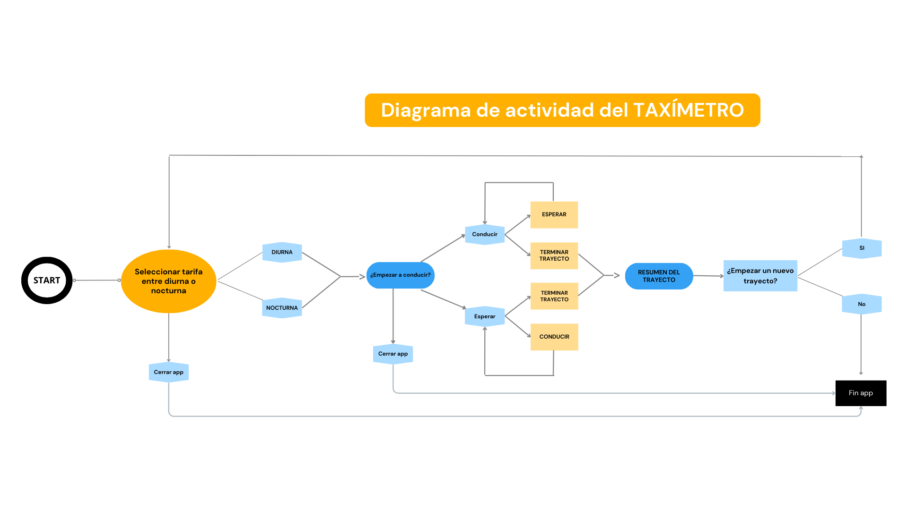

# PROYECTO TAXÍMETRO PARA FACTORIA F5

### En este proyecto de python, el objetivo es crear un taxímetro.

#### Hay 2 maneras de poner en marcha la aplicación:
1. En el terminal
2. Mediante interfaz gráfica

Para instalarlo usa el siguiente código en tu terminal:
````
git clone https://github.com/alharuty/TAXIMETRO.git
````

### 1. Para arrancar el archivo .py (en el terminal) usa el siguiente codigo:

````
python taximetro.py
`````

El programa se iniciará en tu terminal, te dará la bienvenida y te dará opciones a elegir que debes seguir correctamente para finalizar el trayecto. Si insertas algún caracter no válida, te saldrá un error para volver a introductir un carácter válido.

### 2. Para arrancar el archivo .pyw con la interfaz gráfica usa el siguiente código:

```
python taximetro.pyw
```
Este código abrirá la interfaz gráfica, y tiene las mismas funcionalidades que en el terminal pero de forma más atractiva para el usuario.


Carácteres válidos en el terminal:
| Opción | Acción                           |
|--------|----------------------------------|
| A      | Tarifa diurna                   |
| B      | Tarifa nocturna                 |
| Q      | Salir de la app antes de elegir una tarifa |
| C      | Empezar a conducir              |
| E      | Empezar a esperar               |
| Q      | Salir de la app antes de empezar un trayecto |
| F      | Finalizar trayecto y ver resumen |
| S      | Realizar un nuevo trayecto      |
| N      | Salir de la app                 |


En ambos métodos se puede salir de la app en cualquier momento ó volver a realizar un nuevo trayecto. El programa tiene una interfaz amigable basada en texto, permite a los usuarios seleccionar una tarifa (diurna o nocturna) y dependiendo si el taxi está conduciendo o esperando se cobra una tarifa de 0.05 céntimos y 0.02 céntimos por minuto respectivamente.<br>
Al final del trayecto, el sistema muestra un resúmen del precio total, incluyendo tarifa base y el total de la trayectoria.

Además en la version GUI, se guarda un historial de trayectos en el archivo historial.txt

Puedes ver el diagrama de actividad aquí:



### Fortalezas 🔥
✅ El proceso es intuitivo y sin complicaciones<br>
✅ Cálculo basado en tiempo real y tarifas establecidas<br>
✅ Interfaz clara, mensajes detallados y organizados para una mejor experiencia<br>
✅ Sistema de logs si el usuario introduce una entrada inválida en el terminal<br>
✅ Guarda historial de trayectos cuando usamos la interfaz gráfica

### Áreas a mejorar ❗
❌ Incluiría la opción de ingresar los km conducidos<br>
❌ No guarda el historial de viajes cuando usamos la opción del terminal<br>


### PRESENTACIÓN TÉCNICA

Para el buen funcionamiento de la aplicación he utlizado controles de flujo mediante condicionales `if`, `elif`, `else` y `while`.<br>
También he manejado el tiempo actual y transcurrido con la librería `import datetime`.
<br>
Y he usado la librería `import logging` para registrar errores de entrada en el terminal. 
<br>
La función principal se llama Taximetro() y permite:
1. Seleccionar tairfa base entre diurna(3.50€) y tarifa nocturna(4.50€)
2. Calcular tarifas de estado conducción (0.05€/s) y espera(0.02€/s)
3. Devolver el precio total del trayecto.